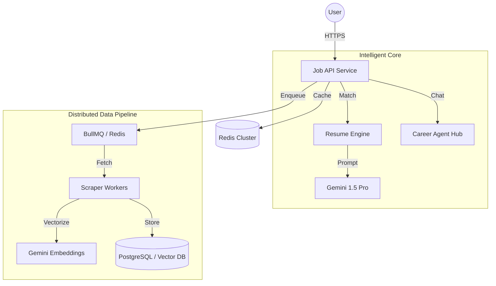
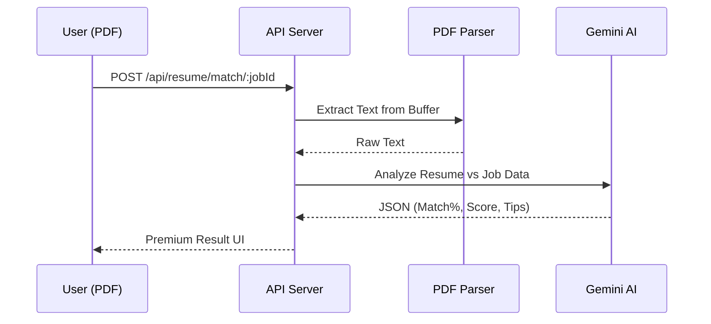

# 🌌 Antigravity: Enterprise Job Intelligence Platform

**Antigravity** is a FAANG-level career intelligence platform. It’s not just a job board; it's a distributed AI ecosystem that automates resume matching, detects fraudulent listings, and provides personalized career roadmaps using a Multi-Agent architecture.

---

## 🖼️ UI/UX Showcase

*Premium Glassmorphism Interface with Integrated Resume Intelligence*

---

## 🚀 Key "Intelligent" Features

### 🔥 1. AI Resume Match Engine (ATS Analysis)
Upload your resume in PDF format and get an instant **ATS Score**. Our Gemini-powered engine extracts your skills and compares them directly with job requirements to give you:
- **Match %** and a detailed fit verdict.
- **Skill Gap Analysis**: Exactly what you need to learn to land the role.
- **Improvement Tips**: Actionable advice to optimize your application.

### 🤖 2. Personalized AI Career Agent
A dedicated hub for career growth. Ask the agent about:
- **Salary Trends**: "What's the roadmap for a ₹20LPA remote React role?"
- **Skill Roadmaps**: Step-by-step guides to bridge your current gap.
- **City Insights**: Market demand heatmaps for tech hubs like Bangalore, Gurgaon, and Pune.

### 🛡️ 3. AI Fraud Intelligence
A robust scam-detection pipeline that analyzes:
- **Recruiter Authenticity**: Detects suspicious domains and patterns.
- **Salary Anomalies**: Flags too-good-to-be-true offers.
- **Multi-Agent Risk Scoring**: Multiple AI agents cross-verify job legitimacy.

---

## 🏗️ System Architecture

---

## 🛠️ Tech Stack

- **Frontend**: React 19, Framer Motion, Lucide Icons.
- **Backend**: Node.js, Express, BullMQ (Distributed Queues).
- **AI/ML**: Google Gemini 1.5 Pro, text-embedding-004.
- **Infra**: Docker, Kubernetes, Terraform, GitHub Actions.
- **Observability**: OpenTelemetry, Pino Logging.

---

## 📡 API Flow: Resume Match Engine

---

## 📄 License

This project is licensed under the **MIT License** - see the [LICENSE](LICENSE) file for details.
*Built with ❤️ by Antigravity Systems (A portfolio-ready enterprise project).*