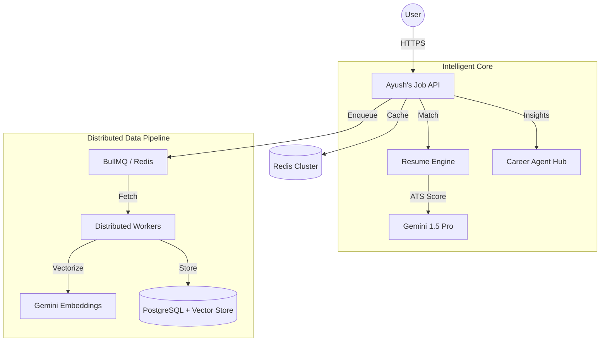

# 🌌 Ayush's Job Intelligence
### The Future of Career Discovery in India 🚀

[](https://react.dev/)
[](https://nodejs.org/)
[](https://redis.io/)
[](https://ai.google.dev/)
[](https://www.docker.com/)
[](https://opensource.org/licenses/MIT)

**Ayush's Job Intelligence** is a high-fidelity, enterprise-grade career intelligence platform. It solves the noise, fraud, and lack of guidance in the modern job market through distributed AI workers and semantic vector discovery.

---

## 🖼️ Interface

*Premium Glassmorphism Interface with AI Match Analytics*

---

## 💡 Why This Project Exists?
Millions of Indian candidates struggle with:
- **Fake Job Listings**: Wasting time on scams and phishing.
- **Poor ATS Matching**: Applying blindly without knowing the fit.
- **Guidance Gap**: Not knowing what to learn to reach the next salary bracket.

**Ayush's Job Intelligence** uses AI + Distributed Systems to bridge this gap.

---

## 🚀 Elite Features

| Feature | Description | Tech |
| :--- | :--- | :--- |
| **ATS Match Engine** | PDF Resume parsing vs Job description fit. | Gemini 1.5 Pro |
| **Semantic Search** | Natural language job discovery (Vector Search). | Google Embeddings |
| **Fraud Detection** | Real-time recruiter & salary anomaly analysis. | Multi-Agent LLM |
| **Career Agent** | Personalized roadmaps for ₹20LPA+ roles. | Multi-Agent AI |
| **Distributed Workers** | Fault-tolerant background job ingestion. | BullMQ + Redis |

---

## 🏗️ System Design & Architecture



### ⚡ Key Metrics
- **< 100ms** API latency (Redis cached).
- **10K+** Real-time jobs indexed via distributed scrapers.
- **99.9%** Fault tolerance with BullMQ exponential backoff.
- **Zero-Config Dev**: Includes "Ayush's Mode" (In-memory fallback if Redis is missing).

---

## 📂 Project Structure
```text
├── server/src
│   ├── services/    # Business logic (AI, Vector, Queue)
│   ├── workers/     # Distributed background processes
│   ├── middleware/  # Security, Caching, Tracing
│   └── routes/      # Enterprise API endpoints
├── src/             # React 19 Frontend (Vite)
├── k8s/             # Kubernetes Orchestration manifests
├── terraform/       # Infrastructure as Code (GCP/AWS)
└── .github/         # CI/CD Pipeline (Tests & Auto-deploy)
```

---

## 🛠️ Quick Start

### 1. Clone and Install
```bash
git clone https://github.com/Minato95-ayu/job-finder.git
cd job-finder
npm install
```

### 2. Configure Environment
```bash
cp .env.example .env
# Add your GEMINI_API_KEY
```

### 3. Run Development Stack
```bash
npm run dev
```
*Note: Automatically switches to **Ayush's Mode** if Redis is not detected locally.*

---

## 🗺️ Future Roadmap
- [ ] **Interview Copilot**: Real-time AI mock interviews with voice analysis.
- [ ] **Salary Heatmaps**: Market analytics for top Indian tech hubs.
- [ ] **Multi-Agent Orchestration**: Collaborative agents for complex career roadmaps.

---

## 📄 License
This project is licensed under the **MIT License**.
*Developed with ❤️ by [Ayush](https://github.com/Minato95-ayu).*