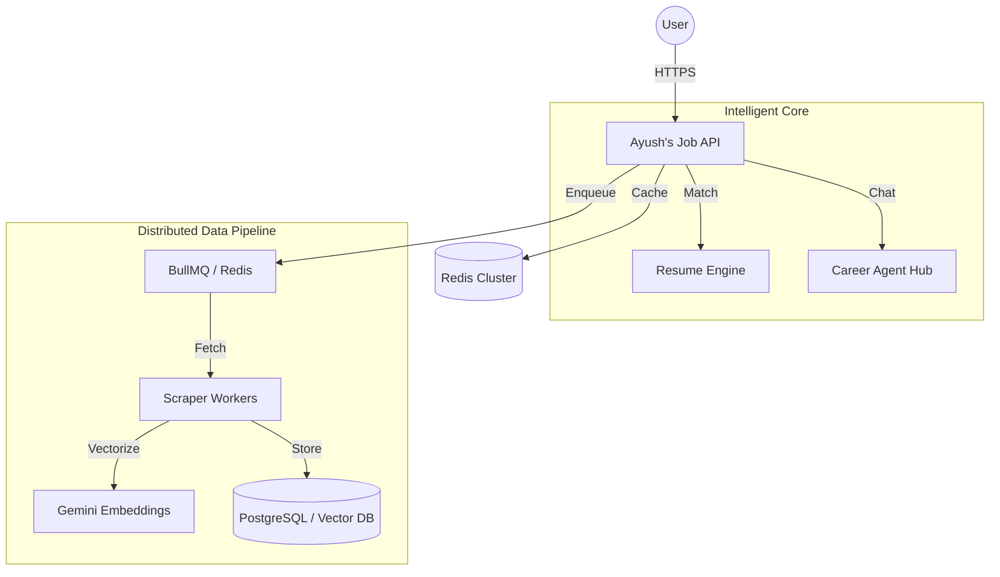

# 🌌 Ayush's Job Intelligence: Enterprise Career Platform

**Ayush's Job Intelligence** is a FAANG-level career intelligence platform developed by Ayush. It’s a distributed AI ecosystem that automates resume matching, detects fraudulent listings, and provides personalized career roadmaps.

---

## 🖼️ UI/UX Showcase

*Premium Glassmorphism Interface powered by Ayush's Intelligence Engine*

---

## 🚀 Key "Intelligent" Features

### 🔥 1. AI Resume Match Engine (ATS Analysis)
Upload your resume in PDF format and get an instant **ATS Score**. Ayush's Gemini-powered engine extracts your skills and compares them directly with job requirements.

### 🤖 2. Personalized AI Career Agent
A dedicated hub for career growth. Ask the agent about salary trends, skill roadmaps, and city-specific insights for tech hubs like Bangalore and Pune.

### 🛡️ 3. AI Fraud Intelligence
A robust scam-detection pipeline that analyzes recruiter authenticity and salary anomalies using multi-agent risk scoring.

---

## 🏗️ System Architecture

---

## 🛠️ Tech Stack

- **Frontend**: React 19, Framer Motion, Lucide Icons.
- **Backend**: Node.js, Express, BullMQ.
- **AI/ML**: Google Gemini 1.5 Pro, text-embedding-004.
- **Infra**: Docker, Kubernetes, Terraform, GitHub Actions.

---

## 📄 License

This project is licensed under the **MIT License** - see the [LICENSE](LICENSE) file for details.
*Built with ❤️ by Ayush.*