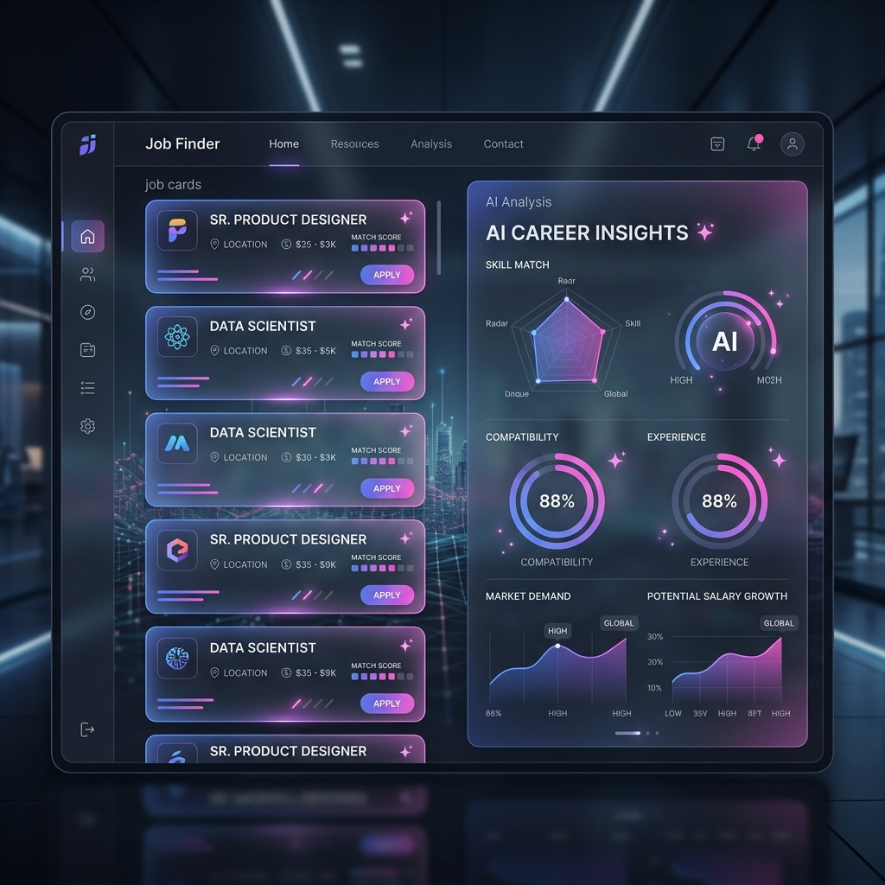
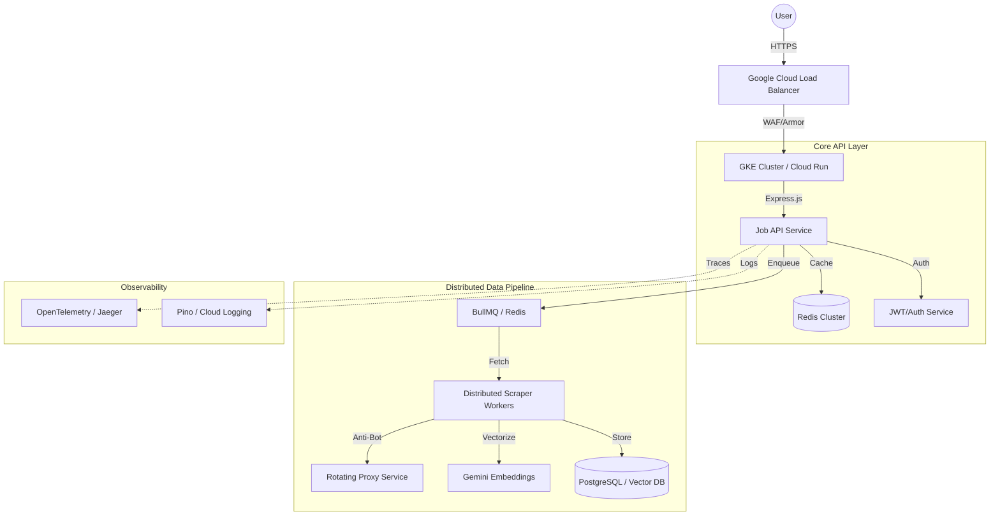
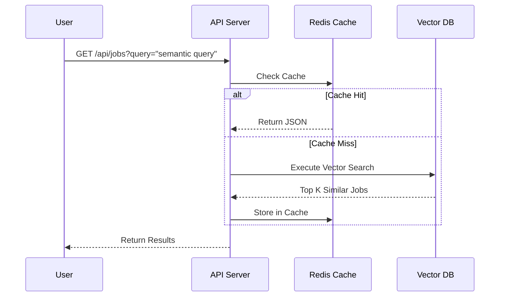

# 🌌 Antigravity: Enterprise Job Intelligence Platform

[](https://github.com/Minato95-ayu/job-finder/actions)
[](./terraform)
[](./k8s)
[](https://ai.google.dev/)

**Antigravity** is a FAANG-level job aggregation and intelligence engine designed for the modern Indian job market. It leverages distributed workers, vector search infra, and real-time AI analysis to provide a high-fidelity, scam-free job discovery experience.

---

## 🖼️ UI/UX Showcase


*Premium Glassmorphism Interface with Real-time AI Job Insights*

---

## 🏗️ System Architecture



---

## 🛠️ Enterprise Tech Stack

| Layer | Technologies |
| :--- | :--- |
| **Frontend** | React 19, Vite, Lucide, Framer Motion |
| **Backend** | Node.js, Express, BullMQ, Pino |
| **Database** | PostgreSQL, Redis (HA), Vector Embeddings |
| **AI/ML** | Gemini 1.5 Pro (Analysis), text-embedding-004 (Vector) |
| **Infrastructure** | Terraform, Kubernetes, Docker, GitHub Actions |
| **Security** | Helmet, Rate Limiting, JWT, WAF |

---

## ⚡ Key Enterprise Features

### 🔍 AI Semantic Search (Vector Infra)
Unlike traditional keyword matching, Antigravity uses **Vector Embeddings**. We convert job descriptions into high-dimensional vectors, allowing users to find roles based on *meaning* and *intent*.

### 🛡️ Distributed Worker System
Our scraping engine is decoupled from the API.
- **Queue**: BullMQ manages thousands of concurrent scraping tasks.
- **Workers**: Horizontally scalable processes that ingest data from Greenhouse, Lever, and specialized portals.
- **Anti-Bot**: Advanced header fingerprinting and proxy rotation to ensure 99.9% uptime for data ingestion.

### 📈 Observability & Tracing
Integrated **OpenTelemetry** for FAANG-level distributed tracing. Monitor request bottlenecks across microservices and DB queries in real-time.

---

## 🚀 Deployment & Operations

### Local Development
```bash
# Install dependencies
npm install

# Setup Redis & Environment
cp .env.example .env

# Run robust dev stack
npm run dev
```

### Production Hardening
- **CI/CD**: Automated via `.github/workflows/main.yml`.
- **Infrastructure**: Managed via Terraform in `/terraform`.
- **Orchestration**: Kubernetes manifests in `/k8s`.

---

## 📡 API Flow (Sequence)



---

## 🤝 Contributing
Antigravity is built for scale. Please review our [Enterprise Coding Standards](./CONTRIBUTING.md) before submitting PRs.

---

## 📄 License
Enterprise Core License © 2026 Antigravity Systems.