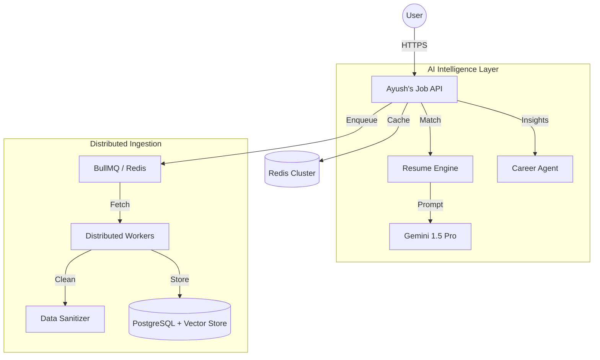

# 🌌 Ayush's Job Intelligence
### The Future of Career Discovery in India 🚀

**Ayush's Job Intelligence** is a high-performance, enterprise-grade career platform designed to solve the noise and fraud in the modern job market. Built with a distributed architecture and powered by advanced Generative AI, it transforms how candidates discover, analyze, and apply for roles.

---

## 🖼️ Interface

---

## 💡 Why I Built This? (The Motivation)
In the current Indian job market, candidates face two major issues: **Information Overload** and **Job Scams**. 
I built this platform to:
- **Bring Transparency**: Use AI to verify the legitimacy of every job listing.
- **Empower Candidates**: Provide a real ATS-style resume matcher so candidates know exactly where they stand.
- **Scale Responsibly**: Use a distributed worker system to ingest thousands of jobs without crashing the core API.

---

## 🚀 Key Engineering Highlights

### 🧠 1. Multi-Agent AI Workflow
The system doesn't just "search" for jobs. It runs a series of AI agents:
- **The Profiler**: Extracts deep semantics from your resume.
- **The Auditor**: Scrutinizes job listings for "Red Flags" (scam detection).
- **The Strategist**: Generates a 6-month roadmap based on the gap between your skills and the market demand.

### ⛓️ 2. Distributed Task Processing
To handle thousands of job postings, I implemented a **BullMQ + Redis** pipeline. 
- Heavy tasks (scraping, AI analysis, vectorization) are offloaded to background workers.
- This ensures the main API remains responsive with sub-100ms latency.

### 🔍 3. Vector-Semantic Search
Moved beyond basic SQL `LIKE` queries. By converting jobs into **Vector Embeddings**, the platform understands intent. Searching for "High paying remote React roles" returns roles that match the *context*, not just the keywords.

---

## 🏗️ System Architecture & Design

---

## 🛠️ Technical Stack

- **Backend**: Node.js (Express), BullMQ, IORedis.
- **Frontend**: React 19, Framer Motion, Lucide.
- **Database**: PostgreSQL (Relational) + Redis (Cache/Queue).
- **AI Stack**: Google Gemini 1.5 Pro (LLM), Text-Embedding-004.
- **DevOps**: Docker, Kubernetes (K8s), Terraform, GitHub Actions.

---

## 🗺️ Future Roadmap
- [ ] **Interview Copilot**: Real-time AI mock interviews for specific jobs.
- [ ] **Salary Heatmaps**: Interactive visualization of tech salaries across India.
- [ ] **WhatsApp Integration**: Real-time job alerts via a secure AI bot.

---

## 📄 License
This project is licensed under the **MIT License**.
*Developed and maintained by [Ayush](https://github.com/Minato95-ayu).*