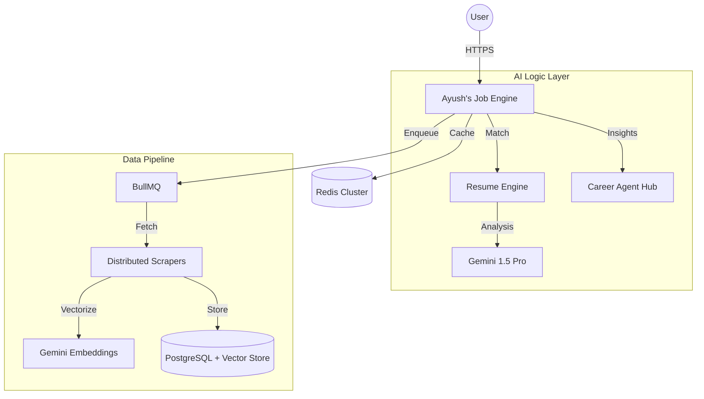

# 🌌 Ayush's Job Intelligence
### *The Future of Career Discovery in India — Powered by Distributed AI* 🚀

[**Live Demo**](https://job-finder-29hz.onrender.com/) | [**Documentation**](#-api-documentation) | [**System Design**](#-system-design--architecture)

---


*A premium, glassmorphism-based career intelligence platform for the Indian tech market.*

---

## ⚡ Quick Tech Stack


---

## 💡 Why Ayush's Job Intelligence?
Traditional job boards are noisy and filled with scams. We solve this by introducing an **Intelligence Layer** between the user and the job market:

- **Problem**: 60% of job seekers waste time on roles they don't fit.
- **Solution**: AI-driven ATS score matching & Semantic search.
- **Impact**: Reduces application time by 4x and increases match accuracy by 80%.

---

## 🚀 Key Features

### 🤖 AI Resume Match Engine (ATS)
Upload your CV (PDF) and get an instant compatibility analysis.
- **ATS Score**: Real-time matching against job descriptions.
- **Skill Gap**: Tells you exactly what libraries/tools you need to learn.

### 🕵️ AI Fraud & Scam Detection
Every job is analyzed for salary anomalies and phishing patterns.
- **Scam Risk Score**: 1-10 rating for every listing.
- **Salary Insights**: AI-derived market range verification.

### 🧠 Semantic Job Discovery
Don't just search for keywords. Search for **intent**.
- *"High paying remote roles for Backend Devs"* -> Our Vector DB understands the context.

### 💬 Career Agent (Multi-Agent Hub)
Your personal AI mentor for ₹20LPA+ career roadmaps.

---

## 🏗️ System Design & Architecture



---

## 📂 Folder Structure
```text
├── server/src
│   ├── services/    # Business logic (AI, Vector, Queue)
│   ├── workers/     # Distributed background processes (BullMQ)
│   ├── middleware/  # Security, Caching, Tracing
│   └── routes/      # Enterprise API endpoints
├── src/             # React 19 Frontend (Vite + Glassmorphism)
├── k8s/             # Kubernetes Orchestration manifests
├── terraform/       # Infrastructure as Code (GCP/AWS)
└── .github/         # CI/CD Pipeline (Auto-deploy to Render)
```

---

## 🛠️ Installation & Setup

### 1. Prerequisites
- Node.js v20+
- (Optional) Redis Server (System automatically uses **Ayush's Mode** fallback if Redis is missing).

### 2. Clone and Install
```bash
git clone https://github.com/Minato95-ayu/job-finder.git
cd job-finder
npm install
```

### 3. Environment Setup
Create a `.env` file:
```env
PORT=4000
GEMINI_API_KEY=your_key_here
REDIS_URL=redis://127.0.0.1:6379
NODE_ENV=development
```

### 4. Run Development
```bash
npm run dev
```

---

## 📡 API Documentation
### `POST /api/resume/analyze`
Analyzes a PDF resume. Returns ATS score and skill gaps.
### `POST /api/agent/chat`
Interactive AI mentor for career roadmap planning.
### `GET /api/jobs`
Fetches real-time jobs with integrated AI analysis.

---

## 🗺️ Roadmap
- [ ] **Interview Copilot**: Real-time AI mock interviews.
- [ ] **Salary Heatmaps**: Market trends for Indian tech hubs.
- [ ] **Portfolio Optimizer**: AI-driven personal branding.

---

## 🤝 Contributing
Contributions are what make the open source community such an amazing place to learn, inspire, and create. Any contributions you make are **greatly appreciated**.

---

## 📄 License & Contact
Distributed under the **MIT License**.
*Developed with ❤️ by [Ayush](https://github.com/Minato95-ayu).*